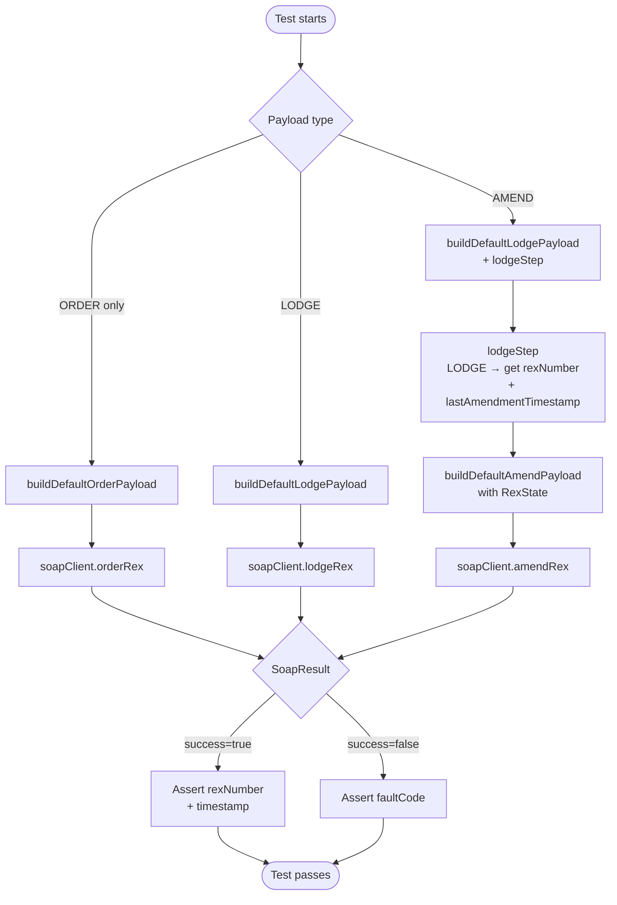
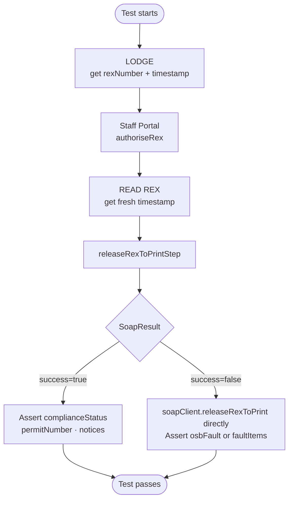
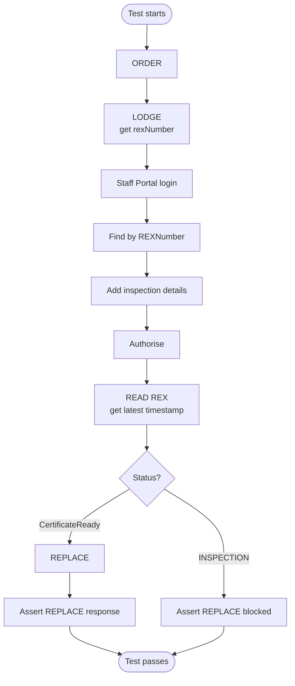
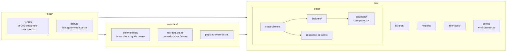

# REX Test Automation — Flow Diagrams

---

## 1. REX Test Flow

```mermaid
flowchart TD
    A([Test starts]) --> B{Payload type}

    B -->|ORDER only| C[buildDefaultOrderPayload]
    B -->|LODGE| D[buildDefaultLodgePayload]
    B -->|AMEND| E[buildDefaultLodgePayload\n+ lodgeStep]

    C --> F[soapClient.orderRex]
    D --> G[soapClient.lodgeRex]
    E --> H[lodgeStep\nLODGE → get rexNumber\n+ lastAmendmentTimestamp]
    H --> I[buildDefaultAmendPayload\nwith RexState]
    I --> J[soapClient.amendRex]

    F --> K{SoapResult}
    G --> K
    J --> K

    K -->|success=true| L[Assert rexNumber\n+ timestamp]
    K -->|success=false| M[Assert faultCode]

    L --> N([Test passes])
    M --> N
```

---

## 2. ReleaseRexToPrint Flow

```mermaid
flowchart TD
    A([Test starts]) --> B[LODGE\nget rexNumber + timestamp]
    B --> C[Staff Portal\nauthoriseRex]
    C --> D[READ REX\nget fresh timestamp]
    D --> E[releaseRexToPrintStep]
    E --> F{SoapResult}
    F -->|success=true| G[Assert complianceStatus\npermitNumber · notices]
    F -->|success=false| H[soapClient.releaseRexToPrint directly\nAssert osbFault or faultItems]
    G --> I([Test passes])
    H --> I
```

---

## 3. REPLACE Hybrid Flow

```mermaid
flowchart TD
    A([Test starts]) --> B[ORDER]
    B --> C[LODGE\nget rexNumber]
    C --> D[Staff Portal login]
    D --> E[Find by REXNumber]
    E --> F[Add inspection details]
    F --> G[Authorise]
    G --> H[READ REX\nget latest timestamp]
    H --> I{Status?}
    I -->|CertificateReady| J[REPLACE]
    I -->|INSPECTION| K[Assert REPLACE blocked]
    J --> L[Assert REPLACE response]
    L --> M([Test passes])
    K --> M
```

---

## 4. Project Architecture

```mermaid
flowchart LR
    subgraph tests[tests/]
        BR[br-002/\nbr-002-departure-date.spec.ts]
        DBG[debug/\ndebug-payload.spec.ts]
    end

    subgraph testdata[test-data/]
        COM[commodities/\nhorticulture · grain · meat]
        RD[rex-defaults.ts\ncreateBuilders factory]
        PO[payload-overrides.ts]
    end

    subgraph src[src/]
        FIX[fixtures/]
        HLP[helpers/]
        INT[interfaces/]
        CFG[config/\nenvironment.ts]
        subgraph soap[soap/]
            SC[soap-client.ts]
            RP[response-parser.ts]
            BLD[builders/]
            XML[payloads/\n*.template.xml]
        end
    end

    tests --> testdata
    tests --> src
    testdata --> src
    SC --> BLD
    SC --> RP
    BLD --> XML
```
